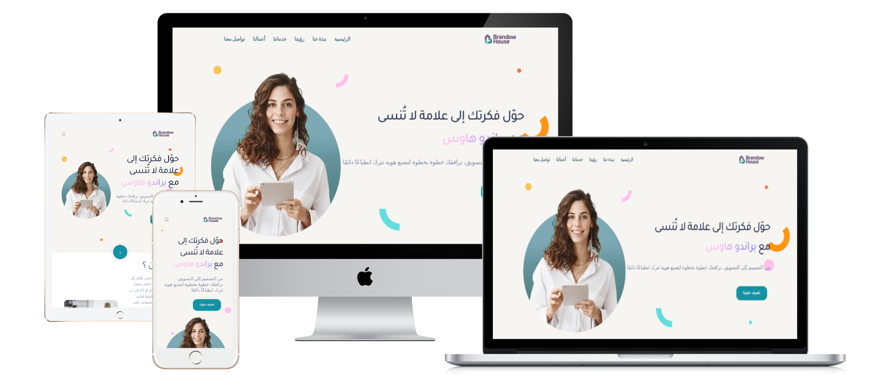
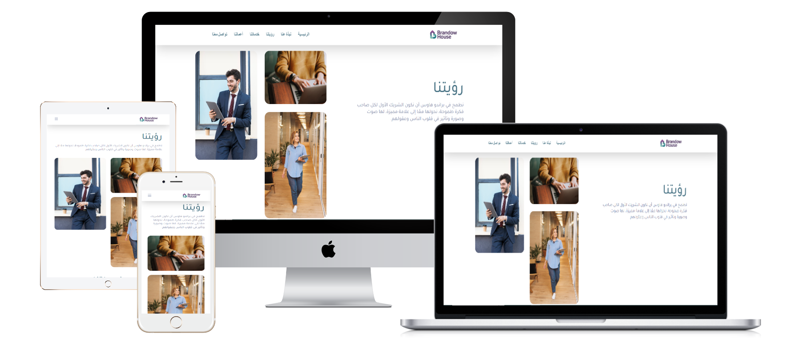
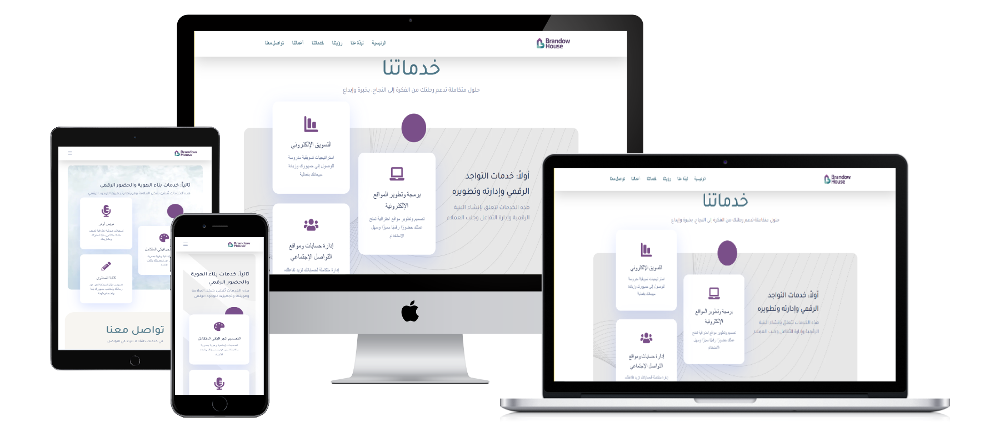

# Brandow-House-Designing-a-Complete-Digital-Identity-That-Leaves-an-Impact
Brandow House – an innovative agency specializing in visual identity building and digital marketing.

## pictures

## 📝 الوصف القصير للمشروع
- العميل: براندو هاوس – وكالة مبتكرة متخصصة في بناء الهوية البصرية والتسويق الرقمي.
- نوع الموقع: موقع مؤسسي تعريفي يعرض خدمات تصميم الهوية التجارية، تصميم واجهات المستخدم (UI/UX)، التسويق الرقمي، كتابة المحتوى، الفويس أوفر، وإدارة الحملات الإعلانية.
- الهدف من التصميم: إنشاء موقع يعكس قوة العلامة التجارية واحترافيتها، مع توفير تجربة مستخدم سلسة وبسيطة تُبرز الخدمات بشكل جذاب وتدفع العملاء للتواصل والتفاعل.
- التقنيات المستخدمة: WordPress | Elementor | HTML | CSS | JavaScript | تصميم متجاوب (Responsive Design)
- 
## 💡 المميزات والتفاصيل الإضافية
- هوية بصرية متكاملة: ألوان وخطوط وتصميم متناسق يعكس شخصية العلامة.
- تجربة مستخدم مميزة (UI/UX): سهولة في التصفح والتنقل بين أقسام الموقع.
- قسم خدمات متنوع: عرض واضح ومباشر لخدمات مثل الفويس أوفر، التسويق الرقمي، وكتابة المحتوى.
- تواصل فعّال: نماذج واتصالات مباشرة عبر البريد ووسائل التواصل الاجتماعي.
- تكامل مع السوشيال ميديا: أيقونات وروابط مباشرة لفيسبوك، إنستجرام، يوتيوب، تيك توك وواتساب.
- تصميم متجاوب بالكامل: تجربة مثالية على جميع الأجهزة (موبايل، تابلت، كمبيوتر).

## 🔗 رابط الموقع: https://darkblue-rabbit-702613.hostingersite.com/

